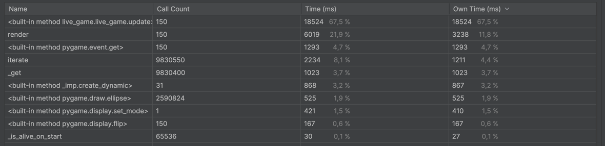
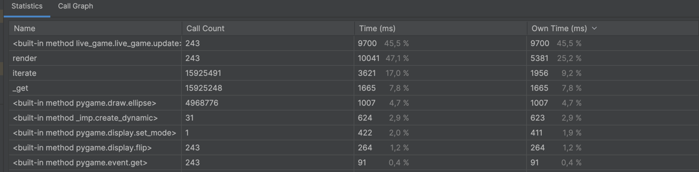
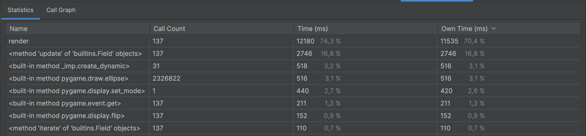
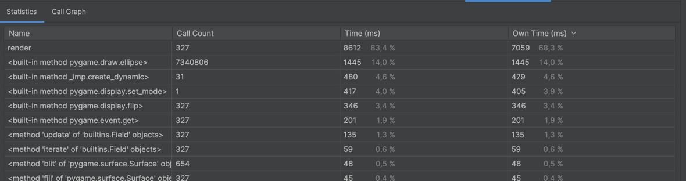
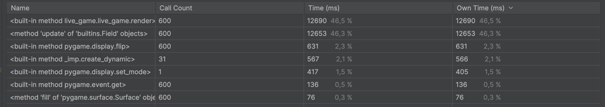
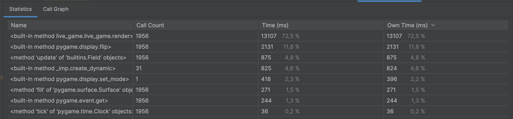
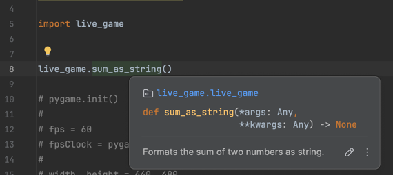

# Игра жизнь

Проект проба rust'а и его интеграции с питоном, на примере CPU bound задачи.

Де факто, это не такая уж вычислительно сложная задача, но упираемся мы именно в CPU


## Почему игра жизнь

Де факто, сам процесс симуляции игры является нагрузочным бенчмарком. Основная работа - CPU математика (довольно
простая, но всё же), которую достаточно легко вынести отдельно и использовать. Но при этом есть сопуствующие нюансы (
нужно работать с питонячими объектами из раста, есть потенциал в обёртке над pygame в том числе ). А кодовая база не
такая большая и сложная как у прод проектов.

## Реализации

Для каждой из реализации (за исключением `--release` сборок) **создана отдельная ветка**, в которую вы можете
переключиться
для проверки и сравнения производительности.

### Запуск

1. python3.10; `pip install -r ./requirements.txt` + rust 1.79.0
2. `maturin develop` или `maturin develop --release` (для release версий)
3. добавить в `PYTHONPATH` src директорию
4. python src/main.py

Шаг 2 и 4 обязательно повторять после переключения в каждую из веток

### Базовая версия

_Ветка:_ **pure-python**

- pre render поля во избежание доп. затрат на рендер (хоть и не шибко больших)
- самые нагруженные методы - `_get` и `_neighbors` (68% CPU time там)
- render занимает порядке 17% времени
- используют numpy массив для состояния поля

### Точечно оптимизированная

_Ветка:_ **partly-optimized**

- `_get` и `_neighbors` заменены на rust реализацию реализацию
- отдельно рассмотреть влияние inline'инга

------


Штош, при первой реализации перфоманс не особо изменился (даже стал чуть хуже).

Почему производительность не поменялась и даже ухудшилась:

- ndarray для хранения был заменён на `list[list[Cell]]`, т.к. я хз какой тип у нампаевского массива, а точнее как его
  скатить. В теории есть крейт для numpy массивов, но это отдельная история (да и тут назревают оптимизации получше)
- abi стандарт принуждает нас особым образом де/серриализовать (скорее маршалинг, но не суть) данные, что создаёт
  накладных расходов больше чем питонячая математика
- как ни странно, оверхед на вызов питонячей функции не сильно ощущается (хотя в `neighbors` вызов `get_from_field` уже
  зашит во внутрь, так что не удивительно). По крайней мере вынос `neighbors` на прямой вызов (вместо одноимённой
  функции обёртки), значимых изменений не дал

Круто было бы задизасемблить библиотеку и посмотреть как оно внутри, в частности, работает ли инлайн (судя по тому что я
позже увидел в https://youtu.be/eDZHEkKZXuU?si=2bBJ6lCwykHD6peI&t=1132 работать он должен, т.к. у нас не `abi3`).

Если не считать совокупление с типами pyo3 (даже примеров нормальных не увидел, долго тыкался), то сама логика уже
пишется без проблем (никаких внизапных вылетов и мудрёных концепций обработки в коде. Если компилиться - то работает. А
ещё в дебаг режиме вылетающие ошибки раста реально понятные, без всяких segfault).

### Точечно оптимизированная (--release flag)

_Ветка:_ **partly-optimized**


Как вы догадались из названия, просто добавился релиз флаг, но перфоманс вырос значительно (на моём mac m1 pro в debug
сборке было порядка 3.9 fps после заполнения карты, а в release сборке порядка 7.9 (и тот и другой с запущенным
cprofile, снапшот которого представлен выше)).

Это уже приятнее (я не ожидал такого буста, думал маршалинг всё сожрёт)

### Заменён update с игровой логикой

_Ветка:_ **update-optimized**

- используется всё то же ~~numpy~~ стандартное поле на списках
- дополнительно заменена логика (вынесен `update`)
- рендер всё ещё идёт по питонячему iterate

-----------

_Дебаг сборка_



_Релиз сборка_



В дебаг сборке порядка 7.9 кадра в секунду, в релиз сборке порядка 11.

Проблем при реализации не встречено, тут всё быстренько по аналогии получилось. Отдельно отмечу супер приятные ошибки,
которые отдаёт раст в дебаг режиме. Всё супер понятно, отлаживать на пару порядков удобнее чем взаимодействие с
плюсами.Да и в целом оно в разы приятнее, никаких биндингов, ничего писать не нужно.

Как видим, рендер уже начинает отжирать порядочно.

### Rust абстракция для поля

_Ветка:_ **field-rust-impl**

- Всё что касается работы с полем (и итерирование и само хранение), перенесено в rust
    - наружу доступен `iterate` для накидывания рендера

------------

_Дебаг сборка_ (~8фпс)



_Релиз сборка_ (~34фпс)



Вот тут уже стало лучше. Даже с учётом кучи копирований в расте (я там далеко не идеальный код написал), перфоманс таки
вполне заметен. Как мы видим, теперь почти всё время у нас занимает рендер, а не наша логика игры.

Данное переписывание далось уже посложнее (то borrow checker цапнет, то ищешь примеры вызова).

Как минимум, не стоит перекидывать между питоном и растом, куда проще замкнуть логику непосредственно в расте и работать
там. В частности пришлось переписать `_get -> Cell`, на `get_state` и `set_state` соответственно (потому что выдать
атомарное значение клетки с поля можно только при его копировании, а делать это, например, в update не очень то
хотелось). В теории это можно было обойти, но нужно больше скила (простор для рефакторинга).

### Заменена логика рендера

_Ветка:_ **render-optimzied**

- логика рендера у `LiveWorld` перенесена в rust

----------

_Дебаг сборка_ (~22фпс)



_Релиз сборка_ (~117фпс)



Де факто куча времени теперь уходит на вызов pygame методов через питон. В теории, можно попробовать вызывать SDL2
методы напрямую (биндинги для раста есть), но это потребует использования куда большей магии (да и для удовлетворения
изначальных целей проекта бесполезно).

## Выводы

### Вопросы к будущим оптимизациям

- насколько сложно интегрировать rust
- как тяжело работать с питонячими объектами
    - в плюсах даже для возвращения null объектов нужны были сакральные знания иначе segfault
- как тяжело работать с внешними библиотеками (numpy и pygame - обвзяки поверх C++, нужно постораться ходить до них в
  обход питон обвязки, по возможности)
- можно ли внедрить в существующий пайплайн разработки наших проектов (у нас есть `poe configure`, как entrypoint
  проекта)
    - сложность сборки исходников под каждой из OS (достаточно ли скачать rust и запускать скриптик при развёртывании
      проекта или нужен бубен)

### Результаты

**WIP**

**Сводная таблица по cprofile и fps**

Рефакторинг под работу с numpy???

### Туториал по добавлению rust в python проекты

- `pip install maturin` для CLI обёртки над rust
- `maturin init` для инициализации rust файлов (в корневой проекта, `где pyproject.toml`, может его зашакалить, нужно
  быть внимательным)
- переименовать директорию в `rust_src` (src по умолчанию)
- поменять путь до файлов библиотеки в `Cargo.toml`
    - ```toml
  [lib]
  path = "rust_src/lib.rs"
    ```
- `maturing develop` для dev сборки библиотеки
    - после вызова будет собран проект (то же самое, что `poetry install --only-root`)
    - rust функции будут доступны для имопрта из проекта (`live_game.sum_as_string`)
        - одна беда, типизация не прокидывается сама
          собой 
        - Но это поправимо https://pyo3.rs/v0.22.2/function/signature
- ??? как собрать prod версию
- ??? Как получать сигнатуры функций (pycharm их показывает, но кэширует внутри до момента сброса индекса, а это
  довольно муторный процесс)

### Проблемы

- jetbrains не соизволила завести поддержку rust'а для pycharm в виде плагина, нужна отдельная IDE (RustRover)